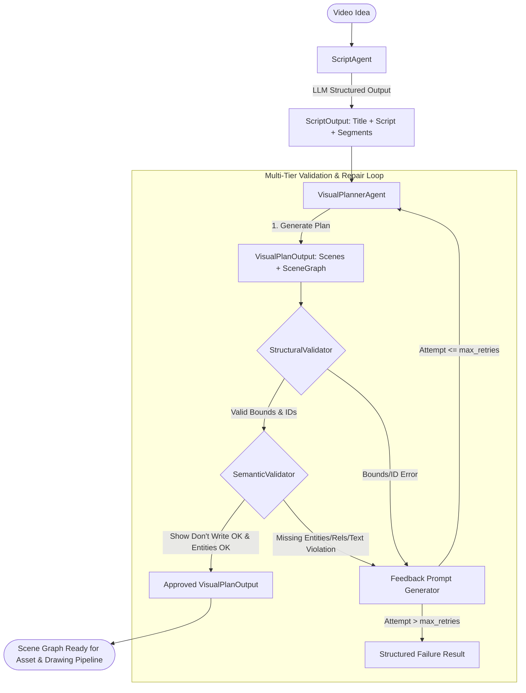

# AI Agents Architecture & Specification: ScriptAgent & VisualPlannerAgent

> Tài liệu đặc tả kiến trúc tác tử AI, quy trình sinh kịch bản và lập kế hoạch thị giác đồ thị cảnh (Visual Scene Graph), được thiết lập tại **Phase 04**.

---

## 1. Triết lý Thiết kế & Nguyên tắc Nền tảng

Hệ thống AI Agents trong AI Whiteboard Video Production Studio được xây dựng dựa trên 4 nguyên tắc cốt lõi:

1. **Nhà cung cấp là chi tiết triển khai (Provider Agnostic)**:
   - Google Gemini chỉ đóng vai trò là một nhà cung cấp (`GeminiProvider`) thông qua giao diện trừu tượng `LLMProvider`.
   - Toàn bộ business logic không phụ thuộc vào Gemini SDK độc quyền, giao tiếp qua REST API chuẩn với JSON Schema hỗ trợ structured output.
   - Hỗ trợ `MockLLMProvider` phục vụ kiểm thử đơn vị độc lập môi trường mạng (offline, CI/CD).

2. **Dữ liệu có cấu trúc là bắt buộc (Structured Output Enforcement)**:
   - Mọi phản hồi từ AI đều được ràng buộc bởi schema Pydantic v2 nghiêm ngặt (`ScriptOutput`, `VisualPlanOutput`).
   - Tuyệt đối không phân tích regex lỏng lẻo từ chuỗi markdown text tự do.

3. **Nguyên tắc "Show Don't Write" (Hình ảnh hóa, không viết chữ)**:
   - Video Whiteboard truyền đạt thông điệp qua các nét vẽ trực quan (nhân vật, đồ vật, sơ đồ, hình ảnh ẩn dụ).
   - Tuyệt đối ngăn chặn hiện tượng AI chỉ viết chữ (ví dụ: tạo entity text "CON KHỈ", "CÂY" thay vì phác thảo nét vẽ con khỉ và cái cây).
   - Các khái niệm trừu tượng (như lạm phát, nhiệt độ, vận tốc) bắt buộc phải chuyển hóa thành **Visual Metaphors** (giỏ hàng ít đồ, nhãn giá bay lên như khinh khí cầu, mũi tên vận tốc, ngọn lửa burner).

4. **Xử lý sự cố và Vòng lặp sửa chữa tự động (Bounded Retries & Self-Repair)**:
   - Khi phản hồi từ LLM bị lỗi cấu trúc hoặc vi phạm logic ngữ nghĩa (thiếu nhân vật, thiếu quan hệ hành động, vi phạm Show Don't Write), hệ thống tự động trích xuất thông tin lỗi đưa vào prompt phản hồi để mô hình sửa sai (`max_retries = 2`).
   - Khi vượt quá số lần thử, hệ thống trả về kết quả lỗi có cấu trúc (`AgentResult(success=False)`), không bao giờ gây sập (crash) pipeline hoặc rơi vào vòng lặp vô tận.

---

## 2. Kiến trúc Luồng Dữ liệu (Agent Pipeline Flow)



---

## 3. Đặc tả ScriptAgent

### 3.1 Nhiệm vụ
Tiếp nhận ý tưởng ban đầu của người dùng, phân tích mục tiêu sư phạm/kể chuyện và chuyển đổi thành kịch bản phân đoạn có nhịp điệu phù hợp với thời lượng vẽ tay.

### 3.2 Input
- `idea` (str): Ý tưởng kịch bản thô hoặc chủ đề cần sản xuất.
- `language` (str): Ngôn ngữ thể hiện (`vi` hoặc `en`).
- `target_duration_sec` (int): Thời lượng mục tiêu tổng thể (mặc định: 30s).
- `style` (str): Phong cách truyền tải (`educational`, `storytelling`, `dynamic`).

### 3.3 Output Schema (`ScriptOutput`)
```python
class ScriptSegment(BaseModel):
    cue_index: int
    text: str
    estimated_duration_sec: float
    semantic_meaning: str
    key_entities: List[str]
    suggested_actions: List[str]

class ScriptOutput(BaseModel):
    title: str
    script: str
    segments: List[ScriptSegment]
    language: str
    target_duration_sec: int
    style: str
```

---

## 4. Đặc tả VisualPlannerAgent

### 4.1 Nhiệm vụ
Phân tích kịch bản và các phân đoạn thoại để kiến trúc nên **Visual Scene Graph** hoàn chỉnh trên canvas chuẩn 1920x1080. Xác định chính xác bố cục không gian, thứ tự lớp vẽ, kiểu thị giác và các cạnh quan hệ hành động giữa các đối tượng.

### 4.2 Input
- `script` (str): Toàn bộ lời dẫn xuyên suốt.
- `segments` (List[ScriptSegment]): Danh sách các phân đoạn thoại có thời lượng và ý nghĩa ngữ nghĩa.
- `canvas` (CanvasSchema): Kích thước canvas (mặc định: 1920 x 1080).

### 4.3 Output Schema (`VisualPlanOutput`)
```python
class SceneVisualPlan(BaseModel):
    scene_index: int
    scene_id: str
    title: str
    duration_ms: int
    narration_text: str
    canvas: CanvasSchema
    scene_graph: SceneGraph
    drawing_actions: List[DrawingAction]

class VisualPlanOutput(BaseModel):
    project_title: str
    scenes: List[SceneVisualPlan]
    notes: str
```

Mỗi thực thể trong SceneGraph được đặc tả rõ:
- `id`: Mã thực thể duy nhất.
- `label`: Nhãn danh từ đối tượng (ví dụ: `monkey`, `tree`, `banana`).
- `visual_type`: `character` | `object` | `diagram` | `metaphor` | `structure` (ngăn cấm `text` làm thực thể chính).
- `importance`: `primary` | `secondary` | `background`.
- `drawing_intent`: Chỉ dẫn phác thảo nét vẽ cho Whiteboard Engine (ví dụ: *"Playful monkey clinging to tree trunk with arm outstretched upwards"*).
- `position`: Tọa độ hình học `Position(x, y, width, height)` nằm trọn trong 1920x1080.
- `layer`: Thứ tự z-index xếp lớp.
- `relationships`: Cạnh quan hệ có hướng (`source_id` -> `action` -> `target_id`).

---

## 5. Danh mục 5 Test Cases Tiêu Chuẩn

Hệ thống đã kiểm thử toàn diện và vượt qua cả 5 trường hợp từ cụ thể đến trừu tượng:

| Test Case | Kịch bản / Narration | Entities | Relationships | Visual Type / Metaphor |
| :--- | :--- | :--- | :--- | :--- |
| **Case 1: Dog running after ball** | Chú chó vui vẻ chạy đuổi theo quả bóng tròn trên bãi cỏ. | `dog`, `ball` | `dog --chasing--> ball` | `character`, `object` |
| **Case 2: Teacher explaining math** | Thầy giáo đứng cạnh bảng đen và nhiệt tình giảng giải công thức toán học. | `teacher`, `mathematics` | `teacher --explaining--> mathematics` | `character`, `diagram` |
| **Case 3: Temperature makes molecules move faster** | Khi nguồn nhiệt độ tăng cao, các phân tử bắt đầu chuyển động nhanh hơn. | `temperature`, `molecules` | `temperature --accelerating--> molecules` | `diagram` (ngọn lửa burner + hạt chuyển động kèm mũi tên vận tốc) |
| **Case 4: Inflation** | Lạm phát tăng vọt làm giảm sức mua của đồng tiền một cách rõ rệt. | `inflation`, `money` | `inflation --eroding--> money` | `metaphor` (nhãn giá khinh khí cầu bay lên + đồng tiền teo nhỏ) |
| **Case 5: Monkey climbing tree for banana** | Con khỉ đang trèo lên cây để lấy một quả chuối chín vàng. | `monkey`, `tree`, `banana` | `monkey --climbing--> tree`<br>`monkey --reaching--> banana`<br>`banana --located_on--> tree` | `character`, `structure`, `object` (Show Don't Write chuẩn) |

---

## 6. Cơ chế Kiểm định và Tự Sửa Lỗi (Semantic & Show Don't Write Validation)

- **Show Don't Write Validation**: Quét mọi thực thể có `importance == "primary"`. Nếu phát hiện `visual_type == "text"` hoặc nhãn chữ thuần túy, lập tức báo lỗi vi phạm.
- **Missing Entity / Relationship Detection**: Quét văn bản thuyết minh, đối chiếu từ điển song ngữ (Việt - Anh) và quy tắc quan hệ để phát hiện thiếu sót.
- **Repair Loop**: Khi phát hiện lỗi, `VisualPlannerAgent` đưa thông báo lỗi chi tiết vào prompt tiếp theo. Mô hình có tối đa 2 lần thử sửa đổi trước khi trả về lỗi có cấu trúc.
