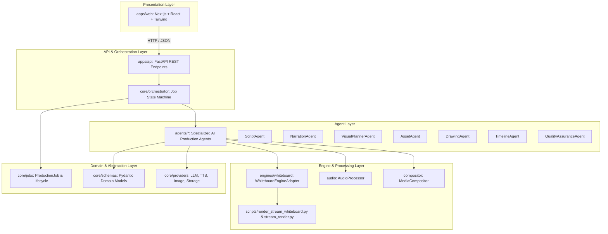
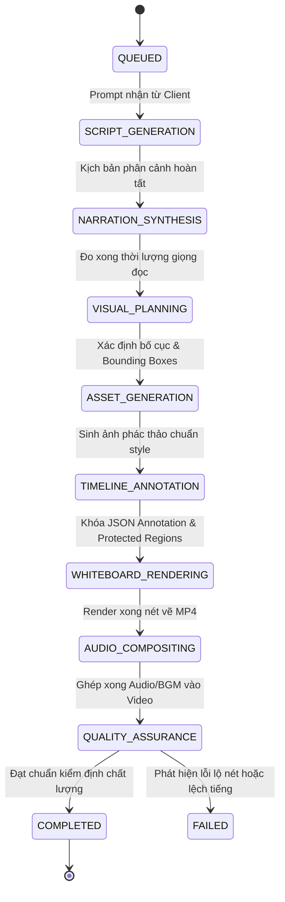

# Architecture Specification: AI Whiteboard Video Production Studio

> Tài liệu đặc tả kiến trúc tổng thể cho hệ thống **AI Whiteboard Video Production Studio**, được thiết lập tại **Phase 02**.

---

## 1. System Overview & Core Philosophy

Hệ thống được thiết kế nhằm mục đích tự động hóa toàn bộ quy trình sản xuất video hoạt hình vẽ tay trên bảng trắng (Whiteboard Animation) theo phong cách tối giản từ một câu lệnh gợi ý (prompt) hoặc kịch bản thô của người dùng.

### 4 Nguyên tắc kiến trúc bất biến:
1. **Phân tách giao diện và nghiệp vụ (UI Separation)**: Tầng giao diện người dùng (`apps/web`) hoàn toàn tách biệt với backend xử lý nghiệp vụ (`apps/api`), giao tiếp thuần túy thông qua REST API và SSE (Server-Sent Events).
2. **Độc lập nền tảng AI (Provider Neutrality)**: Nghiệp vụ sản xuất video không bao giờ phụ thuộc trực tiếp vào bất kỳ nhà cung cấp AI nào (như Google Gemini, OpenAI, ElevenLabs). Mọi tương tác AI đều đi qua tầng trừu tượng (Provider Abstraction Layer).
3. **Cô lập lõi xử lý hoạt họa (Media Engine Isolation)**: Công cụ kết xuất nét vẽ (`engines/whiteboard`) được bao bọc như một dịch vụ chuyên biệt qua lớp Adapter, ngăn chặn sự rò rỉ chi tiết hình học của OpenCV hay PyAV vào tầng điều phối nghiệp vụ.
4. **Mô hình tác tử chuyên biệt hóa (Specialized Agent Architecture)**: Từng khâu trong quy trình sản xuất (biên kịch, phân cảnh, lồng tiếng, tạo hình, vẽ nét, căn chỉnh thời gian, kiểm định chất lượng) được đảm nhiệm bởi các Agent độc lập, chia sẻ ngữ cảnh thông qua `ProductionJob` tập trung.

---

## 2. System Architecture & Dependency Flow

Kiến trúc phân tầng được tổ chức theo chiều phụ thuộc đơn hướng (Clean Architecture):



### Quy tắc chiều phụ thuộc (Dependency Direction):
- `apps/web` chỉ biết `apps/api`.
- `apps/api` phụ thuộc vào `core` và khởi tạo `orchestrator`.
- `agents` phụ thuộc vào `core/schemas` và `core/providers`, không phụ thuộc vào `apps/api` hay `apps/web`.
- `engines/whiteboard` độc lập hoàn toàn với `agents` và `core`, chỉ nhận dữ liệu hình học và cấu hình kết xuất.

---

## 3. Module Breakdown

### 3.1 `apps/web` (Frontend Web Studio)
- **Công nghệ**: Next.js 15 (App Router), React 19, TypeScript, Tailwind CSS.
- **Nhiệm vụ**:
  - Giao diện biên soạn kịch bản và phân cảnh tương tác trực tiếp.
  - Trực quan hóa timeline phân đoạn, hỗ trợ kéo thả bounding box (tích hợp khả năng của `preview.html`).
  - Hiển thị tiến trình sản xuất video thời gian thực từ API.
  - Phát video MP4 kết quả kiểm tra.

### 3.2 `apps/api` (Backend Application Server)
- **Công nghệ**: FastAPI, Uvicorn, Pydantic v2, Pydantic-Settings.
- **Thư mục**:
  - `apps/api/config.py`: Tải và xác thực cấu hình môi trường từ `.env` (không lưu secret trong code).
  - `apps/api/routers/health.py`: Endpoint `GET /health` giám sát sức khỏe dịch vụ.
  - `apps/api/routers/jobs.py`: Quản lý vòng đời `ProductionJob` (`POST /jobs`, `GET /jobs/{id}`, `GET /jobs`).
  - `apps/api/main.py`: Điểm khởi chạy ứng dụng FastAPI và cấu hình CORS.

### 3.3 `core` (Domain Models, Jobs, and Providers)
- `core/schemas/annotation.py`: Mô hình dữ liệu chuẩn của Whiteboard Animation (`CanvasSchema`, `RegionSchema`, `RevealSchema`, `HandPathSchema`, `ElementSchema`, `AnnotationSchema`).
- `core/schemas/script.py`: Cấu trúc phân cảnh kịch bản và câu phụ đề (`SubtitleCue`, `SceneScript`, `ProductionScript`).
- `core/jobs/models.py`: Mô hình `ProductionJob`, `JobStage`, `JobStatus` theo dõi từng giai đoạn xử lý.
- `core/providers/`: Hợp đồng trừu tượng (`LLMProvider`, `TTSProvider`, `ImageProvider`, `StorageProvider`) cùng bản cài đặt `mock.py` cho kiểm thử tự động.
- `core/templates/prompts.py`: Các prompt quy chuẩn về mỹ thuật vẽ tay và phong cách kịch bản.
- `core/assets/manager.py`: Định tuyến và lưu trữ file tài nguyên dự án có cấu trúc.

### 3.4 `agents` (Hệ thống Tác tử Sản xuất Chuyên biệt)
- `agents/script/`: **ScriptAgent** — Phân tích prompt người dùng và lập kịch bản phân cảnh (mỗi cảnh 25–35s).
- `agents/narration/`: **NarrationAgent** — Chuyển câu thoại thành giọng đọc và đo đạc thời lượng chính xác.
- `agents/visual_planner/`: **VisualPlannerAgent** — Lên bố cục thị giác, xác định các phần tử và tọa độ bounding box.
- `agents/asset/`: **AssetAgent** — Tạo hình minh họa nét mực đen trên nền giấy ngà đúng visual guideline.
- `agents/drawing/`: **DrawingAgent** — Cấu hình thông số nét vẽ (grid/skeleton, contour-wipe/brush) và gọi engine kết xuất.
- `agents/timeline/`: **TimelineAgent** — Đồng bộ nhịp độ thời gian thoại, tính toán `protectedRegions` che chắn nét đè.
- `agents/qa/`: **QualityAssuranceAgent** — Kiểm định tự động tính toàn vẹn của video (không lộ nét sớm, đủ thời gian gaze).

### 3.5 `engines/whiteboard` (Whiteboard Media Engine Boundary)
- Đóng gói các script xử lý cốt lõi `scripts/render_stream_whiteboard.py` và `scripts/merge_scenes.py`.
- Lớp `WhiteboardEngineAdapter` cung cấp phương thức gọi an toàn qua môi trường ảo cách ly, bắt lỗi `subprocess` và trả về đường dẫn file kết quả hoặc ném ngoại lệ rõ ràng.

### 3.6 `audio` & `compositor`
- `audio/processor.py`: Trừu tượng hóa việc xử lý âm lượng, cắt gọt và thêm khoảng lặng (silence padding) vào giọng đọc.
- `compositor/muxer.py`: Trừu tượng hóa việc ghép kênh (muxing) giữa luồng video của Whiteboard Engine và luồng âm thanh thoại + BGM.

---

## 4. Provider Abstraction Architecture

Để đảm bảo hệ thống không bị "khóa chặt" (vendor lock-in) vào Google Gemini hay bất kỳ nhà cung cấp nào, mọi giao tiếp bên ngoài đều thông qua các Interface trừu tượng:

```text
               +---------------------------------------+
               |        Core Application Logic         |
               +---------------------------------------+
                                  |
            +---------------------+---------------------+
            |                     |                     |
     [LLMProvider]         [TTSProvider]         [ImageProvider]
            |                     |                     |
     +------+------+       +------+------+       +------+------+
     |             |       |             |       |             |
[Gemini]       [OpenAI] [ElevenLabs] [EdgeTTS] [Flux/SD]   [Mock]
 (Impl)         (Impl)    (Impl)      (Impl)    (Impl)     (Test)
```

### Các Interface chuẩn:
1. **`LLMProvider`**:
   - `generate_text(messages, temperature, max_tokens) -> LLMResponse`
   - `generate_structured(messages, response_schema) -> BaseModel`
2. **`TTSProvider`**:
   - `synthesize_speech(text, voice_id, language, speed) -> AudioSynthesisResult`
3. **`ImageProvider`**:
   - `generate_image(prompt, style_preset, width, height) -> ImageGenerationResult`
4. **`StorageProvider`**:
   - `save_asset(path, data, content_type) -> uri`
   - `get_asset(path) -> bytes`
   - `exists(path) -> bool`
   - `get_public_url(path) -> url`

Mọi provider đều có bản triển khai `Mock` trong `core/providers/mock.py`, cho phép chạy toàn bộ test suite cục bộ mà không cần kết nối mạng hay khóa API trả phí.

---

## 5. Job State Machine & Production Lifecycle

Một `ProductionJob` trải qua 8 trạng thái giai đoạn nối tiếp:



Mỗi bước chuyển trạng thái đều cập nhật mốc thời gian `started_at`, `completed_at` và tỷ lệ phần trăm tiến độ tổng thể.

---

## 6. Whiteboard Media Engine Boundary & Invariants

Media Engine ban đầu từ Phase 01 (`scripts/render_stream_whiteboard.py`) được bảo toàn tuyệt đối, đóng vai trò hạ tầng cấp thấp (Layer 0).

### Các bất biến kỹ thuật bắt buộc:
1. **Nền giấy ấm**: Không dùng nền trắng tinh, lấy mẫu từ ảnh gốc hoặc fallback về `#F6F1E3`.
2. **Che chắn phân vùng (Allowed Mask)**:
   $$\text{Allowed Mask} = \text{Region}_i \setminus \left( \bigcup_{j > i} \text{Region}_j \right) \setminus \left( \bigcup \text{ProtectedRegions}_i \right)$$
   Đảm bảo nét vẽ của phân cảnh tương lai hoặc đối tượng đè lên không bao giờ xuất hiện sớm.
3. **Tỷ lệ nét mực và màu sắc**: Cố định tỷ lệ `ink_weight:color_weight = 2:1`.
4. **Khoảng lặng chiêm ngưỡng (Gaze)**: Bắt buộc tối thiểu 500ms tĩnh ở khung hình cuối cùng.

---

## 7. Testing Strategy

Chiến lược kiểm thử được tự động hóa hoàn toàn với 3 cấp độ:

1. **Backend Tests (`tests/backend/`)**:
   - Kiểm tra endpoint `GET /health` bằng `TestClient`.
   - Kiểm tra nạp cấu hình và giá trị mặc định của `AppSettings`.
   - Kiểm tra tạo mới và truy vấn chi tiết `ProductionJob` qua REST API.
2. **Core Domain Tests (`tests/core/`)**:
   - `test_imports.py`: Đảm bảo tất cả các module trong `core`, `agents`, `engines`, `audio`, `compositor` đều import sạch, không vòng lặp (circular dependency).
   - `test_providers.py`: Đảm bảo các mock provider tuân thủ nghiêm ngặt hợp đồng trừu tượng (abstract contracts).
   - `test_jobs.py`: Kiểm thử chuyển đổi trạng thái và tính toán tiến độ công việc.
   - `test_schemas.py`: Xác thực dữ liệu file annotation thực tế (`examples/scene-01-monkey-mountain-banana.annotation.json`) khớp 100% với Pydantic schema.
3. **Frontend Tests (`apps/web`)**:
   - `npm run build`: Kiểm tra toàn bộ tính tương thích kiểu dữ liệu (TypeScript typecheck) và quá trình biên dịch tối ưu hóa Next.js.
   - Kiểm tra khởi động live server Next.js thành công.
