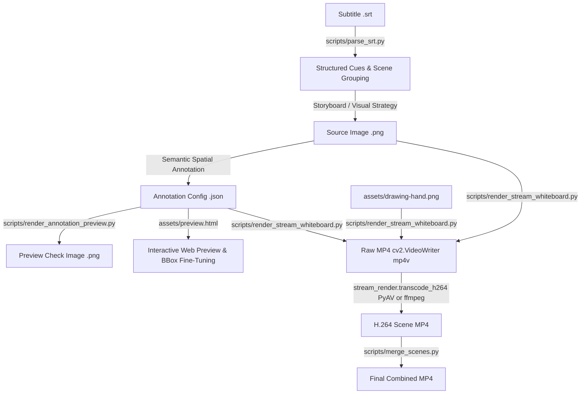

# Architecture Baseline: Whiteboard Media Engine

> Tài liệu phân tích kiến trúc baseline cho repository nền tảng `srt-whiteboard-animation` thuộc **Phase 01** của dự án **AI Whiteboard Video Production Studio**.

---

## 1. Repository Structure

Cấu trúc thư mục thực tế của repository tại baseline:

```text
srt-whiteboard-animation/
├── .git/                                # Git version control metadata
├── .gitignore                           # Quy định bỏ qua file tạm (output, cache)
├── LICENSE                              # MIT License
├── README.md                            # Tài liệu giới thiệu, hướng dẫn sử dụng và thông số
├── SKILL.md                             # Quy chuẩn kỹ thuật, workflow và ràng buộc vận hành Skill
├── agents/
│   └── openai.yaml                      # Khai báo metadata agent/Codex skill
├── assets/
│   ├── drawing-hand.png                 # Ảnh mẫu bàn tay cầm bút vẽ (RGBA, 802 KB)
│   └── preview.html                     # Giao diện web xem trước và hiệu chỉnh annotation (HTML5 Canvas + File System Access API)
├── examples/
│   ├── sample_story.srt                 # Subtitle mẫu tạo trong quá trình baseline testing
│   ├── scene-01-monkey-mountain.png     # Ảnh vẽ phác thảo gốc (1230 KB)
│   ├── scene-01-monkey-mountain-banana.png # Ảnh vẽ hoàn chỉnh dùng cho demo (2411 KB)
│   ├── scene-01-monkey-mountain-banana.annotation.json # File cấu hình phân vùng và kịch bản hoạt hình mẫu
│   ├── scene-01-monkey-mountain-banana-whiteboard.mp4  # Video MP4 mẫu xuất xưởng (1198 KB)
│   ├── scene-01-monkey-mountain-banana-whiteboard.gif  # GIF demo kết quả
│   └── scene-01-monkey-mountain-stream.gif             # GIF demo luồng nét vẽ
├── scripts/
│   ├── prepare_env.py                   # Script khởi tạo virtualenv (.venv) và cài đặt dependencies
│   ├── parse_srt.py                     # Bộ phân tích phụ đề SRT và phân đoạn phân cảnh (scenes)
│   ├── render_annotation_preview.py     # Script kết xuất ảnh kiểm tra bounding box và thứ tự vẽ
│   ├── render_stream_whiteboard.py      # Bộ kết xuất video chính (kết hợp mask orchestration + stream strokes)
│   ├── stream_render.py                 # Core engine xử lý thuật toán phân tích nét vẽ, tô màu và overlay tay vẽ
│   └── merge_scenes.py                  # Script ghép nối nhiều cảnh MP4 thành một video hoàn chỉnh
├── docs/                                # Tài liệu kiến trúc và tiến độ kỹ thuật
│   ├── ARCHITECTURE_BASELINE.md         # (Tài liệu này)
│   └── progress/
│       └── PHASE-01.md                  # Báo cáo kết quả kiểm thử và nghiệm thu Phase 01
└── out/                                 # Thư mục chứa artifact kết xuất từ baseline test (git-ignored)
```

---

## 2. Rendering Pipeline

Pipeline hoàn chỉnh từ file phụ đề SRT thô đến video MP4 cuối cùng hoạt động theo quy trình tuần tự sau:



### Các bước chi tiết trong pipeline:
1. **Phân tích phụ đề (`parse_srt.py`)**:
   - Đọc phụ đề SRT với regex thời gian `(\d+):(\d{2}):(\d{2})[,.](\d{1,3})`.
   - Tính toán `startMs`, `endMs`, `durMs` cho từng cue.
   - Nhóm các cue thành từng Scene với độ dài mục tiêu lý tưởng từ 25s - 35s (`sceneDurationMs`).
2. **Khởi tạo dữ liệu hình ảnh & Annotation (`annotation.json`)**:
   - Định nghĩa kích thước `canvas` (khớp chính xác với pixel của ảnh gốc).
   - Chia ảnh thành các phần tử ngữ nghĩa (`elements`), sắp xếp theo `sequence` từ 1..N.
   - Thiết lập vùng chữ nhật `region` (`x`, `y`, `width`, `height`), thời gian vẽ `reveal.startMs`, `reveal.durationMs`, và các vùng bảo vệ `protectedRegions`.
3. **Xem trước và hiệu chỉnh (`render_annotation_preview.py` & `preview.html`)**:
   - `render_annotation_preview.py`: Vẽ bounding box các màu, số thứ tự, hướng vẽ và vector `handPath` lên ảnh tĩnh để đối soát.
   - `preview.html`: Chạy cục bộ trên trình duyệt, tải ảnh và JSON qua File System Access API, hiển thị hiệu ứng quét chữ nhật (rectangle wipe) kết hợp trừ vùng `destination-out` cho các layer kế tiếp, cho phép kéo thả bounding box và lưu trực tiếp.
4. **Kết xuất nét vẽ dòng chảy (`render_stream_whiteboard.py` & `stream_render.py`)**:
   - Khởi tạo canvas dùng chung nền giấy ấm (`#F6F1E3`).
   - Phân tích ngưỡng nhị phân Gaussian thích ứng (`cv2.adaptiveThreshold`) để bóc tách nét mực (`ink_pixels`).
   - Duyệt tuần tự từng `element` theo thời gian:
     - Tính `allowed_mask`: lấy vùng `region` của element hiện tại, trừ đi vùng `region` của tất cả element phía sau (`later_elements`) và trừ đi `protectedRegions`.
     - Phân bổ thời gian: `ink_weight:color_weight = 2:1`.
     - Pha 1 - Hạ nét mực (`ink`): Dùng thuật toán Grid Path hoặc Skeleton Path, bám theo vector nét vẽ, đồng thời stamp bàn tay vẽ theo tọa độ đầu bút.
     - Pha 2 - Lên màu (`color`): Sử dụng thuật toán quét đường viền `contour-wipe` (sóng sin kép kết hợp trường cản trở suy giảm theo hàng) hoặc `brush` (cọ tròn lông tơ).
   - Pha 3 - Chiêm ngưỡng (`gaze`): Bù khung hình tĩnh hiển thị 100% hình ảnh nguyên bản trong ít nhất 500ms sau khi hoàn tất vẽ.
5. **Mã hóa và Ghép nối (`transcode_h264` & `merge_scenes.py`)**:
   - Video trung gian được ghi dưới định dạng `mp4v` qua OpenCV `VideoWriter`.
   - Chuyển mã sang H.264 (YUV420p) bằng `ffmpeg` hoặc fallback `PyAV`.
   - Ghép nhiều scene liên tiếp thành video tổng bằng `merge_scenes.py`.

---

## 3. Important Files

| File | Đường dẫn | Chức năng chính |
|---|---|---|
| `scripts/prepare_env.py` | `scripts/prepare_env.py` | Tạo môi trường cô lập `.venv`, cài đặt và kiểm tra 4 phụ thuộc bắt buộc: `opencv-python`, `numpy`, `av`, `Pillow`. |
| `scripts/parse_srt.py` | `scripts/parse_srt.py` | Parser SRT đa nền tảng, tính toán timestamp millisecond, phân cụm subtitle cues thành các scene 25-35s. |
| `scripts/render_stream_whiteboard.py` | `scripts/render_stream_whiteboard.py` | Runner kết xuất video whiteboard tích hợp: quản lý canvas chung, tính toán `allowed_mask`, điều phối luồng ink/color theo sequence. |
| `scripts/stream_render.py` | `scripts/stream_render.py` | Core engine toán học/thị giác máy tính (79 KB): trích xuất nét mực, phân loại đối tượng/văn bản/đường bao, Zhang-Suen skeleton, contour wipe resistance field, stamp bàn tay `TipOverlay`, transcode H.264. |
| `scripts/render_annotation_preview.py` | `scripts/render_annotation_preview.py` | Tạo ảnh tĩnh trực quan hóa các bounding box, thứ tự `sequence`, mũi tên hướng bút và nhãn phần tử. |
| `scripts/merge_scenes.py` | `scripts/merge_scenes.py` | Nối nhiều file MP4 lại thành một clip thống nhất, hỗ trợ lossless concat (`ffmpeg`) và re-encode concat (`PyAV`). |
| `assets/preview.html` | `assets/preview.html` | Ứng dụng client-side SPA (Canvas2D) cho phép người dùng xem trước timeline, kéo chỉnh tọa độ, thứ tự vẽ và lưu ngược vào file `.annotation.json`. |
| `assets/drawing-hand.png` | `assets/drawing-hand.png` | Asset bàn tay cầm bút dạ với kênh alpha trong suốt (kích thước gốc 1024x1024). |

---

## 4. Data Structures

Cấu trúc chuẩn của file cấu hình phân cảnh `<tên-ảnh>.annotation.json`:

```json
{
  "sceneId": "scene-01",
  "canvas": {
    "width": 1672,
    "height": 941
  },
  "storyBasis": "Tóm tắt sự kiện ngữ nghĩa của phân cảnh trong kịch bản",
  "sceneDurationMs": 8600,
  "elements": [
    {
      "id": "element_unique_id",
      "label": "Tên mô tả đối tượng",
      "sequence": 1,
      "narrativeRole": "Vai trò kịch bản (ví dụ: bối cảnh, nhân vật, xung đột, kết quả)",
      "subtitle": "Đoạn phụ đề lời thoại tương ứng với phần tử này",
      "type": "structure | character | object | text",
      "region": {
        "x": 20,
        "y": 120,
        "width": 540,
        "height": 780
      },
      "reveal": {
        "direction": "top_to_bottom | bottom_to_top | left_to_right | right_to_left",
        "startMs": 300,
        "durationMs": 2600,
        "maskPaddingPx": 22,
        "protectedRegions": [
          {
            "x": 480,
            "y": 200,
            "width": 80,
            "height": 100
          }
        ]
      },
      "handPath": {
        "start": [290, 130],
        "end": [290, 890],
        "easing": "easeInOut"
      }
    }
  ]
}
```

### Chi tiết các trường cốt lõi:
- **`canvas`**: Khai báo kích thước pixel nguyên bản (`width`, `height`). Tọa độ của tất cả các phần tử phải tham chiếu tuyệt đối theo hệ quy chiếu này.
- **`sequence`**: Số nguyên tăng dần (1, 2, 3...) xác định thứ tự xuất hiện của các thành phần theo diễn biến kịch bản, không phụ thuộc vào vị trí hình học trên khung hình.
- **`sceneDurationMs`**: Tổng thời lượng của cả phân cảnh tính bằng millisecond.
- **`region`**: Bounding box hình chữ nhật giới hạn đối tượng (`x, y, width, height`).
- **`protectedRegions`**: Danh sách các hộp chữ nhật bên trong vùng vẽ của đối tượng hiện tại nhưng bị đối tượng xuất hiện sau đè lên. Bắt buộc bị trừ khỏi `allowed_mask` để không làm lộ nét của đối tượng sau khi đối tượng trước đang được vẽ.
- **`handPath`**: Vector đường bay của tay vẽ giả lập dùng cho `preview.html`. Trong render thật của `stream_render`, tọa độ đầu bút bám trực tiếp theo tọa độ pixel của nét mực thật.

---

## 5. Rendering Engine

### Cơ chế hoạt động của `RegionStreamRenderer` & `stream_render`:
1. **Resizing & Dimension Alignment**:
   - Khung hình đầu vào được co giãn sao cho cạnh dài đạt `cap_long_edge` (mặc định 1080px).
   - Chiều rộng và chiều cao được làm tròn theo bội số của `grid_edge` (10px) và đảm bảo là số chẵn để tương thích bộ mã hóa video H.264.
2. **Canvas Khởi tạo & Đồng nhất màu nền**:
   - Màu nền giấy chuẩn: Hex `#F6F1E3` hoặc `#F5EBD7`.
   - `_match_original_background()`: Lấy mẫu màu tại 4 góc của ảnh gốc. Những pixel trên ảnh gốc có khoảng cách màu nhỏ hơn `match_bg_threshold` (28) sẽ được thay thế bằng màu nền canvas để quá trình tô màu không để lại vệt loang viền.
3. **Bóc tách nét mực (Ink Extraction)**:
   - Sử dụng `cv2.adaptiveThreshold` (Gaussian C, kích thước cửa sổ 15, hằng số C = 10). Pixel có giá trị < `ink_threshold` (10) được đánh dấu là nét mực đen (`ink_pixels`).
4. **Phân vùng che chắn bất biến (Mask Invariant)**:
   - `_allowed_mask(element, later_elements)`:
     $$\text{Mask} = \text{Region}_{\text{current}} \setminus \left( \bigcup \text{Region}_{\text{later}} \right) \setminus \left( \bigcup \text{ProtectedRegions} \right)$$
   - Đảm bảo tính bất biến tuyệt đối: Không một pixel nào thuộc về đối tượng tương lai hoặc vùng đè bị xuất hiện trước mốc thời gian quy định.
5. **Tạo quỹ đạo nét vẽ (Stroke Path Generation)**:
   - **Chế độ Grid (`grid`)**: Gom các ô 10x10 có nét mực, phân loại đối tượng (`classify_stroke_groups`: `subject`, `text`, `contour`), tách các đoạn liên kết mỏng (`_split_bridge_connected_component`), duyệt theo thuật toán tham lam gradient mật độ mực (`_gradient_walk`) hoặc quét dòng ngang cho chữ viết (`_text_scan_order`).
   - **Chế độ Skeleton (`skeleton`)**: Áp dụng thuật toán làm mảnh Zhang-Suen để tìm xương đơn pixel của nét vẽ, lần vết 8 hướng lân cận, làm mịn Chaikin và tái lấy mẫu đều khoảng cách 2.5px.
6. **Mô phỏng bàn tay vẽ (`TipOverlay`)**:
   - Sử dụng asset `drawing-hand.png` với đầu bút được căn mốc neo chính xác tại `(tip_anchor_x, tip_anchor_y) = (0.0, 0.0)`.
   - Ghép phủ bàn tay bằng phép hòa trộn alpha kênh 4 lớp (`mask_region * hand + (1 - mask_region) * canvas`).
   - Nếu không tìm thấy file ảnh bàn tay, engine tự động kích hoạt fallback tạo bút dạ procedural (`_procedural_tip`) bằng toán đồ họa hình học trực tiếp.

---

## 6. Existing Limitations

1. **Chưa hỗ trợ xử lý âm thanh (Audio Stream)**:
   - Renderer hiện tại chỉ sinh video câm (video-only). Không có cơ chế gắn file audio lồng tiếng (voiceover) hay nhạc nền (BGM) vào MP4.
2. **Khung vẽ tuần tự đơn luồng (Strictly Serial Drawing)**:
   - Chỉ có thể vẽ lần lượt từng vùng một (1 bút duy nhất). Nếu 2 element có `startMs` trùng nhau, renderer sẽ vẽ nối tiếp nhau chứ không vẽ song song.
3. **Phụ thuộc font chữ Windows cục bộ**:
   - `scripts/render_annotation_preview.py` hardcode đường dẫn font `C:/Windows/Fonts/msyh.ttc` (Microsoft YaHei). Sẽ phát sinh ngoại lệ nếu chạy trên Linux/macOS Docker container.
4. **Mã hóa video qua PyAV khi thiếu FFmpeg**:
   - Trên các máy tính không cài sẵn ffmpeg toàn cục trong PATH, hệ thống chuyển sang PyAV. PyAV libx264 trong script gốc gặp lỗi timestamp (PTS) khi ghép nhiều clip (`merge_scenes.py`).
5. **Vấn đề mã hóa console Windows CP1252**:
   - Khi chạy bằng Python trên Windows PowerShell mặc định mà không có cờ UTF-8, các print log chứa tiếng Trung gây lỗi `UnicodeEncodeError`.
6. **Chưa có API / Web Service**:
   - Toàn bộ repo hiện là CLI cục bộ, chưa có interface RESTful, WebSocket tiến trình, hay queue quản lý tác vụ ngầm.

---

## 7. Integration Opportunities

1. **AI Script-to-SRT & Storyboard Generator**:
   - Tích hợp LLM để nhận prompt ý tưởng của người dùng, tự động phân cảnh và tạo file SRT với timestamp căn chuẩn cho từng câu.
2. **AI Line-Art Visual Generation**:
   - Tích hợp API sinh ảnh (Flux/SDXL/DALL-E) với style prompt cố định theo chuẩn: tối giản, vẽ nét mực đen, phong cách phác thảo Notion, nền vàng nhạt `#F5EBD7`, không có chữ thừa.
3. **AI Vision Annotation Auto-Tagging**:
   - Sử dụng Vision LLM (như Gemini Vision / Claude Vision) để tự động nhận diện các đối tượng trong ảnh, tạo các bounding box `region`, trích xuất `protectedRegions` và map với từng dòng phụ đề trong SRT mà không cần người dùng tự vẽ tay trong `preview.html`.
4. **TTS (Text-to-Speech) Audio & Video Synchronizer**:
   - Tích hợp engine TTS (Edge TTS, ElevenLabs, OpenAI Voice) để sinh giọng đọc cho từng câu thoại, đo đạc chính xác thời lượng giọng đọc thực tế để tự động điền vào `sceneDurationMs` và `durationMs`.
5. **Audio-Video Multiplexing**:
   - Thêm bước muxing âm thanh vào `stream_render.transcode_h264` và `merge_scenes.py` để video MP4 xuất xưởng có đầy đủ giọng đọc và nhạc nền.

---

## 8. Risks

1. **Thời gian kết xuất (Render Latency)**:
   - Render ở 60 FPS với độ phân giải 1080p bằng CPU đơn luồng mất khoảng 40 - 50 giây cho một cảnh 8.6 giây (tỷ lệ xấp xỉ 5:1 so với thời gian thực). Cần tối ưu hóa hoặc đưa vào hàng đợi nền (background worker).
2. **Nguy cơ tràn bộ nhớ / File I/O trung gian**:
   - OpenCV `VideoWriter` ghi file `_raw.mp4` dạng uncompressed mp4v trước khi transcode PyAV. Cần quản lý dọn dẹp file rác tự động.
3. **Xung đột vùng đè phức tạp (Overlap Artifacts)**:
   - Nếu kịch bản có các đối tượng lồng ghép chằng chịt, việc trừ mask chữ nhật (`region`) có thể cắt phạm vào các nét vẽ của đối tượng hiện tại nếu không dùng `protectedRegions` chuẩn xác.
