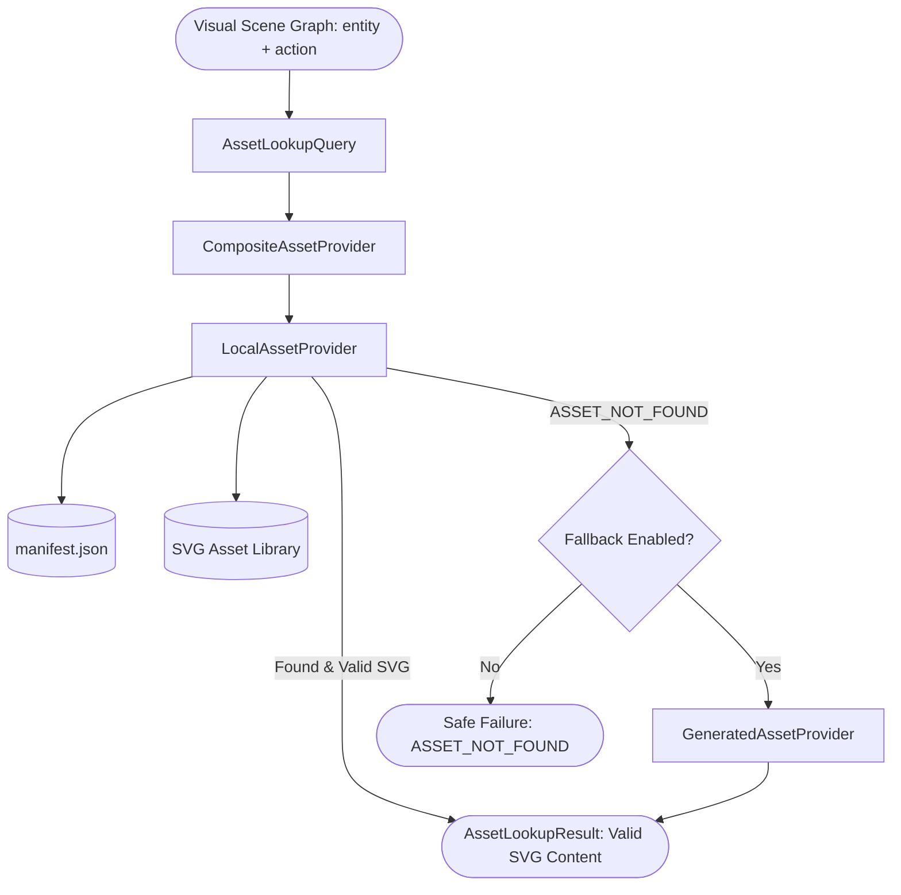

# Asset System & SVG Vector Library: AI Whiteboard Video Studio

> Tài liệu đặc tả hệ thống quản lý tài nguyên thị giác (Asset System) và thư viện vector SVG có tư thế/hành động linh hoạt, được thiết lập tại **Phase 05**.

---

## 1. Triết lý Thiết kế

Trong hệ thống Whiteboard Video Production Studio, **Asset System** đóng vai trò là cầu nối vật lý giữa ý niệm ngữ nghĩa trong **Visual Scene Graph** (sinh ra bởi VisualPlannerAgent) và các hình vẽ vector thực tế sẵn sàng để render nét bút và animate:

1. **Deterministic First (Ưu tiên tính tất định)**:
   - Các thực thể cốt lõi (như `monkey`, `tree`, `banana`, `dog`, `ball`, `teacher`, `mathematics`) được định nghĩa sẵn dưới dạng các file SVG chuẩn mực mỹ thuật Whiteboard (nét mực đen mảnh, phong cách line art tối giản).
   - Không bị phụ thuộc vào các API sinh ảnh ngẫu nhiên bên ngoài khi chạy và kiểm thử core pipeline.

2. **Khả năng biểu diễn tư thế và hành động đa dạng (Pose & Action Flexibility)**:
   - Một thực thể trực quan không chỉ là một hình vẽ tĩnh duy nhất. Ví dụ: Chú khỉ (`monkey`) có thể biểu diễn ít nhất 6 tư thế khác nhau tùy theo ngữ cảnh của Scene:
     * `standing`: Đứng thẳng chào và vẫy tay.
     * `climbing`: Bám thân cây leo trèo lên ngọn.
     * `eating`: Ngồi thưởng thức quả chuối chín vàng.
     * `walking`: Bước đi 4 chân sải bước.
     * `sitting`: Ngồi gãi đầu tò mò suy nghĩ.
     * `jumping`: Bật nhảy trên không vươn tay về phía trước.

3. **Tra cứu thông minh và Chịu lỗi an toàn (Graceful Asset Lookup)**:
   - Hỗ trợ tra cứu song ngữ (tiếng Việt và tiếng Anh) qua danh mục từ khóa (`tags`).
   - Tự động suy diễn tư thế (pose) từ hành động (`action`) trong Scene Graph.
   - Khi không tìm thấy asset, trả về kết quả `error_code="ASSET_NOT_FOUND"`, tuyệt đối **không crash** hệ thống.
   - Kiểm định tính toàn vẹn cú pháp XML của file SVG trước khi đưa vào pipeline.

4. **Kiến trúc Nhà cung cấp có thể mở rộng (Extensible Provider Architecture)**:
   - Hệ thống chia thành các Provider độc lập: `LocalAssetProvider` (file tĩnh), `GeneratedAssetProvider` (sinh động theo yêu cầu), và `CompositeAssetProvider` (ghép chuỗi tự động fallback).

---

## 2. Kiến trúc Hệ thống Asset



---

## 3. Cấu trúc Mô hình Dữ liệu (Asset Domain Models)

### 3.1 `VisualAsset`
Mô hình tài nguyên hoàn chỉnh tuân thủ Pydantic v2:
- `id` (str): Mã định danh duy nhất (ví dụ: `asset_monkey`, `asset_tree`).
- `name` (str): Tên chuẩn hóa của thực thể (`monkey`, `tree`, `banana`).
- `category` (str): Phân loại (`character`, `structure`, `object`, `diagram`, `metaphor`).
- `tags` (List[str]): Bộ từ khóa tra cứu đa ngữ (ví dụ: `['khỉ', 'chú khỉ', 'con khỉ', 'monkey', 'ape']`).
- `format` (str): Định dạng file (`svg` hoặc `png`).
- `path` (str): Đường dẫn file SVG mặc định.
- `poses` (Dict[str, AssetPose]): Bản đồ các tư thế/biến thể thị giác có sẵn.
- `actions` (List[str]): Danh sách các hành vi/động tác tương thích.
- `metadata` (Dict[str, Any]): Tác giả, license, thông số nét vẽ (`line_color`, `stroke_width`).

### 3.2 `AssetPose`
- `name` (str): Tên tư thế (`standing`, `climbing`, `eating`, `walking`, `sitting`, `jumping`).
- `file_path` (str): Đường dẫn file SVG tương ứng.
- `view_box` (str): Thuộc tính SVG viewBox chuẩn (ví dụ: `0 0 500 500`).
- `description` (str): Mô tả chi tiết trực quan.

### 3.3 `AssetLookupQuery` & `AssetLookupResult`
- Nhận diện `label`, `action`, `pose`, `category`, `format`.
- Trả về `found` (bool), `asset` (VisualAsset), `selected_pose` (str), `resolved_path` (str), `svg_content` (str), `error_code` (str).

---

## 4. Danh mục Thư viện SVG Chuẩn

Thư mục: `assets/library/`

| Asset ID | Entity Name | Poses Hỗ Trợ | Files SVG Tương Ứng | Phân Loại |
| :--- | :--- | :--- | :--- | :--- |
| `asset_monkey` | `monkey` | `standing`<br>`climbing`<br>`eating`<br>`walking`<br>`sitting`<br>`jumping` | `svg/monkey_standing.svg`<br>`svg/monkey_climbing.svg`<br>`svg/monkey_eating.svg`<br>`svg/monkey_walking.svg`<br>`svg/monkey_sitting.svg`<br>`svg/monkey_jumping.svg` | Character |
| `asset_tree` | `tree` | `default`<br>`with_bananas` | `svg/tree_palm.svg`<br>`svg/tree_with_bananas.svg` | Structure |
| `asset_banana` | `banana` | `single`<br>`bunch` | `svg/banana_single.svg`<br>`svg/banana_bunch.svg` | Object |
| `asset_dog` | `dog` | `running` | `svg/dog_running.svg` | Character |
| `asset_ball` | `ball` | `default` | `svg/ball.svg` | Object |
| `asset_teacher` | `teacher` | `explaining` | `svg/teacher.svg` | Character |
| `asset_blackboard_math` | `mathematics` | `default` | `svg/blackboard_math.svg` | Diagram |
| `asset_temperature_heat` | `temperature` | `default` | `svg/temperature_heat.svg` | Diagram |
| `asset_molecules` | `molecules` | `default` | `svg/molecules_diagram.svg` | Diagram |
| `asset_inflation` | `inflation` | `default` | `svg/inflation_balloon.svg` | Metaphor |
| `asset_money` | `money` | `default` | `svg/money_wallet.svg` | Metaphor |

---

## 5. Quy trình Tra Cứu Asset (Asset Lookup Workflow)

Khi `VisualPlannerAgent` sinh ra một thực thể trong Scene Graph:
```text
Entity: label="chú khỉ", action="climbing"
```

1. **Bước 1: Normalized Lookup**:
   - Truy vấn `LocalAssetProvider.lookup(AssetLookupQuery(label="chú khỉ", action="climbing"))`.
   - Tìm kiếm nhãn `chú khỉ` trong trường `tags` của `manifest.json` $\rightarrow$ Khớp với `asset_monkey`.
2. **Bước 2: Pose Selection**:
   - Nhận diện `action="climbing"`.
   - Đối chiếu danh mục `asset_monkey.poses` $\rightarrow$ Khớp chính xác với pose `climbing`.
   - Nếu action không khớp với pose nào, tự động fallback về pose `default` hoặc `standing`.
3. **Bước 3: Integrity Validation**:
   - Kiểm tra file `svg/monkey_climbing.svg`: kiểm tra file tồn tại, đọc XML, xác minh thẻ `<svg>` và cấu trúc thẻ đóng hợp lệ.
   - Nếu file bị hỏng $\rightarrow$ Trả về `INVALID_ASSET`.
4. **Bước 4: Return Reference**:
   - Trả về `AssetLookupResult` hoàn chỉnh kèm đường dẫn tuyệt đối và chuỗi nội dung XML SVG để đưa vào Rendering Engine.

---

## 6. Kiểm Thử Trực Quan (Visual Inspection)

Trang kiểm định thị giác được đặt tại:
- [assets/library_preview.html](file:///d:/Tool/assets/library_preview.html)

Trang này hiển thị:
- Danh sách 6 tư thế của Monkey.
- Cây dừa nhiệt đới và nải chuối vàng.
- Phối cảnh kết hợp (Composite Scene) mô phỏng phân cảnh 1920x1080 với con khỉ leo cây lấy chuối đúng tỷ lệ và z-index.
