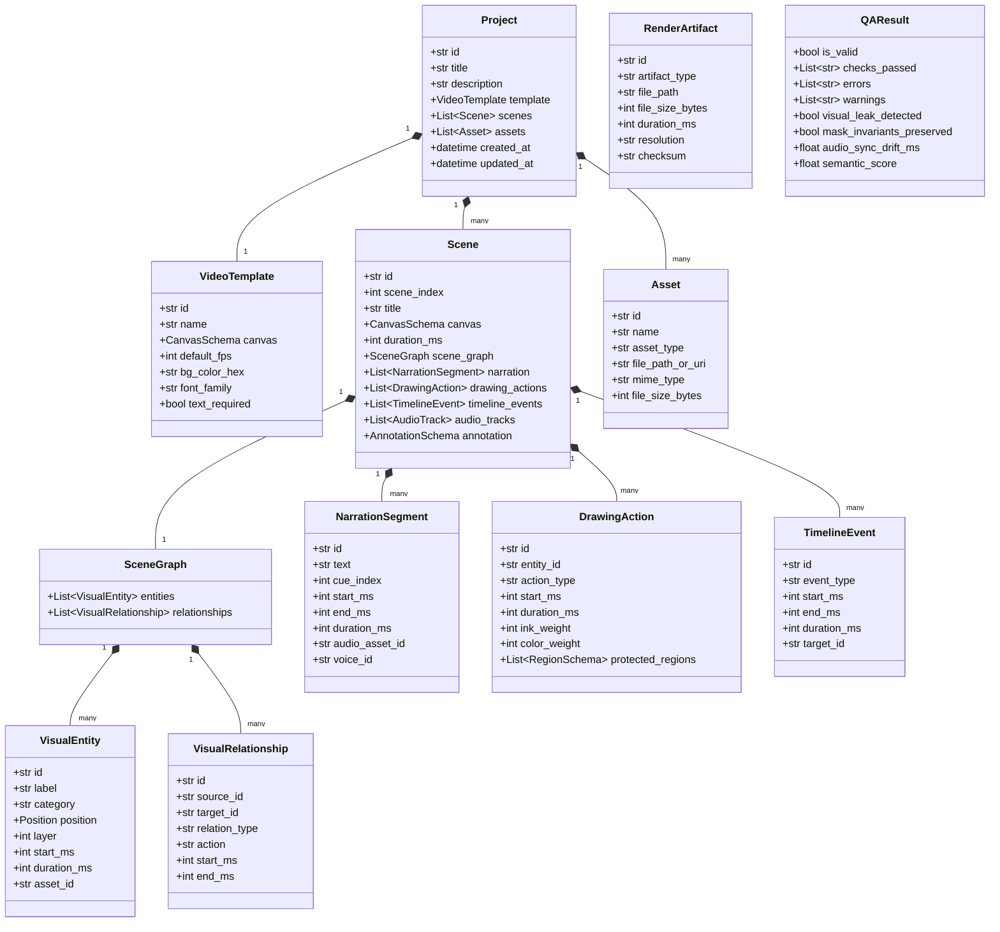
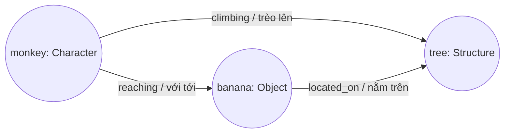

# Data Model Specification: AI Whiteboard Video Production Studio

> Tài liệu đặc tả mô hình dữ liệu chuẩn (Core Schemas & Validation) cho toàn bộ pipeline sản xuất video Whiteboard, được thiết lập tại **Phase 03**.

---

## 1. Overview & Philosophy

Mô hình dữ liệu của AI Whiteboard Video Production Studio được xây dựng dựa trên nguyên lý **Domain-Driven Design (DDD)** và **Strongly-Typed Schemas (Pydantic v2)**, đáp ứng các mục tiêu:
1. **Biểu diễn cấu trúc ngữ nghĩa phong phú**: Thay vì chỉ lưu danh sách các hộp chữ nhật rời rạc, hệ thống mô hình hóa phân cảnh dưới dạng một **Visual Scene Graph** bao gồm các thực thể (Entities), các mối quan hệ (Relationships) và các hành động (Actions).
2. **Xác thực đa tầng (Multi-tier Validation)**:
   - **Tầng cú pháp & biên hình học (Structural Validation)**: Kiểm tra tính duy nhất của ID, giới hạn tọa độ Canvas, thứ tự thời gian không bị đảo ngược và toàn vẹn tham chiếu tài nguyên.
   - **Tầng logic kịch bản (Semantic Validation)**: Đối chiếu nội dung lời thoại (Narration) với đồ thị thị giác để đảm bảo không bỏ sót nhân vật/vật thể và hành động mấu chốt.
3. **Tương thích ngược (Backward Compatibility)**: Liên kết trực tiếp và có thể chuyển đổi 1:1 sang định dạng `annotation.json` của Whiteboard Media Engine đã kiểm chứng tại Phase 01.

---

## 2. Core Entities & Class Hierarchy

---

## 3. Visual Scene Graph Model

Đồ thị cảnh thể hiện trực quan không chỉ **vị trí** của đối tượng mà còn mô tả **sự tương tác** theo thời gian thực:

### Thuộc tính của một thực thể (VisualEntity):
- **`Position`**: Tọa độ pixel chữ nhật (`x, y, width, height`) trong hệ tọa độ canvas.
- **`Layer`**: Thứ tự lớp vẽ từ dưới lên trên (Layer 0 là background/cây cối, Layer 1 là hoa quả/vật dụng, Layer 2 là nhân vật chuyển động).
- **`Timing`**: Mốc bắt đầu vẽ `start_ms` và thời lượng `duration_ms`.

---

## 4. Multi-tier Validation Rules

### 4.1 Structural Validation (`StructuralValidator`)
Bảo đảm tính toàn vẹn kỹ thuật trước khi chuyển dữ liệu sang Media Engine:
1. **Tính duy nhất của ID (ID Uniqueness)**: Không được trùng lặp ID giữa các `VisualEntity`, `VisualRelationship`, `TimelineEvent`, `Scene`, hoặc `Asset`.
2. **Giới hạn biên hình học (Coordinate Bounds)**:
   - $x \ge 0, y \ge 0, \text{width} > 0, \text{height} > 0$.
   - $x + \text{width} \le \text{canvas.width}$
   - $y + \text{height} \le \text{canvas.height}$
   - Bất kỳ đối tượng nào vượt quá biên canvas đều bị **REJECT** kèm thông báo lỗi chi tiết.
3. **Toàn vẹn quan hệ (Relationship Link Integrity)**:
   - `source_id` và `target_id` phải tồn tại trong danh sách thực thể của SceneGraph.
   - `source_id` không được phép trùng `target_id` (tránh self-loop vô nghĩa trong phân cảnh).
4. **Tham chiếu tài nguyên (Asset References)**:
   - Mọi `asset_id` được trỏ tới từ Entity hoặc AudioTrack phải tồn tại trong kho `Project.assets`.
5. **Tính liên tục thời gian (Timestamp Consistency)**:
   - `start_ms >= 0`, `end_ms >= start_ms`.
   - `start_ms + duration_ms <= scene.duration_ms`.

### 4.2 Semantic Validation (`SemanticValidator`)
Phát hiện sai lệch logic giữa kịch bản chữ (Narration) và hình ảnh (Visual Plan):
1. **Kiểm tra thiếu thực thể (Missing Entity Detection)**:
   - Ví dụ: Lời thoại có "Con khỉ trèo lên cây." nhưng Scene Graph chỉ có `monkey`, `car`, `banana` $\rightarrow$ Phát hiện lỗi: `Missing entity: 'tree'`.
2. **Kiểm tra thiếu hành động / quan hệ (Missing Action / Relationship Detection)**:
   - Ví dụ: Lời thoại có "con khỉ trèo lên cây" (yêu cầu quan hệ `monkey -> climbing -> tree`) nhưng Scene Graph không khai báo quan hệ `climbing` $\rightarrow$ Phát hiện lỗi: `Missing relationship: monkey -> climbing -> tree`.

---

## 5. Regression Fixture: `monkey-banana-demo`

Fixture mẫu chuẩn hóa tại `tests/fixtures/monkey-banana-demo/scene.json`:
- **Canvas**: $1920 \times 1080$
- **Thời lượng**: 10,000ms
- **Thực thể**:
  - `tree` (Structure, $x=200, y=150, w=700, h=850$, Layer 0)
  - `banana` (Object, $x=650, y=250, w=180, h=180$, Layer 1)
  - `monkey` (Character, $x=400, y=300, w=320, h=450$, Layer 2)
- **Mối quan hệ**:
  - `monkey -> climbing -> tree` (Hành động: trèo lên cây)
  - `monkey -> reaching -> banana` (Hành động: với tới quả chuối)
  - `banana -> located_on -> tree` (Vị trí: nằm trên cây)
- **Lời thuyết minh**:
  > "Con khỉ đang trèo lên cây và với lấy quả chuối ở trên cây."
- **Quy chuẩn văn bản**:
  - `text_required = false` (Không vẽ chữ trong hình).
- **Trạng thái kiểm thử**: Đạt chuẩn Structural Validation (100%) và Semantic Validation (100%).
