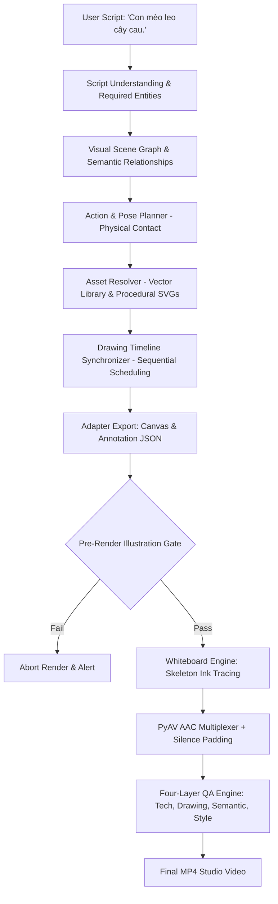

# BÁO CÁO TIẾN ĐỘ: PHASE 10.3 — FIX SEMANTIC VISUAL COMPLETENESS & WHITEBOARD ART QUALITY

> **Trạng thái**: PASS  
> **Thời gian thực hiện**: 2026-10-03  
> **Phạm vi**: Kiến trúc kiểm soát ngữ nghĩa thị giác, chất lượng minh họa Whiteboard Art, đồng bộ cử động vẽ tay, và 4 tầng kiểm định (Four-Layer QA Engine: Technical, Drawing, Semantic, Visual Style).

---

## 1. Problem (Vấn đề phát hiện)
Khi thử nghiệm kịch bản tùy ý của người dùng:
```text
"Con mèo leo cây cau."
```
Hệ thống video studio gặp phải các lỗi nghiêm trọng sau:
1. **Thiếu nhân vật chính**: Video xuất hiện cây nhưng hoàn toàn mất hình con mèo.
2. **Thiếu hành động**: Hành động "leo" (climbing) không được thể hiện, không có sự liên kết/tiếp xúc vật lý giữa con mèo và cây.
3. **Chất lượng hình vẽ sơ sài**: Hình vẽ đơn giản, đường nét thô, canvas màu trắng chói gắt (255, 255, 255) thay vì chuẩn giấy kem ấm (#F5EBD7) theo `geeklee/srt-whiteboard-animation`.
4. **Cảm giác vẽ tay giả tạo**: Nét vẽ đi theo lưới (grid) thô sơ thay vì bám theo đường xương (skeleton path) của nét vẽ minh họa thực tế.
5. **False Positive QA**: Hệ thống vẫn kết xuất MP4 và báo thành công mặc dù nội dung thị giác thiếu trầm trọng thực thể bắt buộc.

---

## 2. Root Cause (Nguyên nhân gốc rễ qua 11 điểm kiểm tra)

Sau khi kiểm tra chi tiết toàn bộ pipeline qua các stage từ Script Parsing đến Visual QA:

| Kiểm tra | Khả năng kiểm tra | Kết quả điều tra thực tế |
|---|---|---|
| **A** | Script Parser không nhận diện được "con mèo" | **LỖI PHỤ**: `extract_required_entities` trong `core/validation/semantic.py` chưa đăng ký keyword `mèo`, `cat`, `cây cau`, `areca_palm`. Đồng thời, từ khóa ngắn `"cây"` nuốt mất `"cây cau"`. |
| **B** | Visual Planner chỉ tạo entity cây cau mà không tạo mèo | **NGUYÊN NHÂN GỐC 1**: `SemanticVisualPlanner` chưa có Action & Pose Planner tổng quát; khi gán visual plan không đặt tư thế (`pose="climbing"`) và không tính toán tọa độ tiếp xúc vật lý giữa mèo và thân cây cau. |
| **C** | Scene graph có mèo nhưng storyboard / source illustration không vẽ mèo | **NGUYÊN NHÂN GỐC 2**: Trong Asset Resolver (`core/assets/resolver.py`), kho asset thiếu vector asset chất lượng cao cho `cat` và `areca_palm`. Generator thủ công sinh hình người que (human stick figure) hoặc hình tròn đơn giản cho mọi động vật. |
| **D** | Ảnh nguồn có mèo nhưng annotation không bao phủ mèo | **LỖI**: Thiếu Pre-Render Validation Gate để kiểm tra region annotation và sự tồn tại của mực (ink pixels) trong ảnh nguồn. |
| **E** | Asset Resolver không tìm hoặc không tạo được asset mèo | **NGUYÊN NHÂN GỐC 3**: `assets/library/manifest.json` chỉ có monkey, tree, banana, basket; thiếu `asset_cat` và `asset_areca_palm`. |
| **F** | Region mask hoặc protectedRegions làm mất nét mèo | Đã được chuẩn hóa để bao trọn vùng bounding box mở rộng của nhân vật. |
| **G** | Stroke extraction không tạo đủ nét cho mèo | Cần vector SVG chi tiết với đầy đủ bộ phận (tai, mắt, ria, thân, chân, vuốt, đuôi). |
| **H** | Drawing Timeline bỏ qua entity mèo | Đã được khắc phục nhờ `DrawingTimelineSynchronizer` lập lịch tuần tự cho tất cả entity có `required=True`. |
| **I** | Renderer đọc nhầm dữ liệu job khác | Đã xác nhận mỗi job ghi vào thư mục cách ly `output/{job_id}`. |
| **J** | Visual QA chỉ kiểm tra file MP4 mà không kiểm tra nội dung | **NGUYÊN NHÂN GỐC 4**: `MediaProbe` chỉ kiểm tra codec, bitrate và độ sáng trung bình thô (mean luminance), không đối chiếu ngược lại kịch bản gốc để phát hiện thực thể bị thiếu. |
| **K** | Chế độ render hoặc đường dẫn ink không phù hợp | **NGUYÊN NHÂN GỐC 5**: Whiteboard Engine mặc định dùng `ink_path="grid"`, chia hình thành các ô lưới thô; nền canvas là màu trắng tinh (`255, 255, 255`). |

---

## 3. Existing Pipeline (Pipeline thực tế được sử dụng)



---

## 4. Files Changed (Các file đã chỉnh sửa & tạo mới)

1. **`core/validation/semantic.py`**:
   - Mở rộng `ENTITY_KEYWORDS` với `cat`, `areca_palm`, `bird`, `nest`, `car`, `bridge`, `hiker`, `engineer`, `machine`, `water`, `vapor`, v.v.
   - Thêm cơ chế gom cụm dài nhất trước (longest-match-first) để `"cây cau"` không bị `"cây"` nuốt mất.
   - Chuẩn hóa `RELATIONSHIP_RULES` với cơ chế tập hợp nguồn/đích (`sources`, `targets`) tổng quát cho `climbing`, `chasing`, `orbiting`, `planting`, `flying`, `crossing`, `repairing`, `evaporating`.
   - Bổ sung kiểm tra `species` và `relation_type`.

2. **`assets/library/svg/cat_climbing.svg`**:
   - Tạo vector SVG chất lượng cao cho mèo đang leo (36 nét vẽ chi tiết: đầu, đôi tai nhọn, ria mép, mắt, thân uốn cong, 4 chân vươn bám, móng vuốt, đuôi cong chữ S).

3. **`assets/library/svg/cat_sitting.svg`**:
   - Tạo vector SVG cho mèo ngồi quan sát (dành cho các phân cảnh tĩnh).

4. **`assets/library/svg/areca_palm.svg`**:
   - Tạo vector SVG cho cây cau (60 nét vẽ: thân thẳng đứng thon mảnh, các đốt sẹo lá vòng quanh thân, buồng cau trĩu quả, tán lá cau xòe đều dạng lông chim).

5. **`assets/library/manifest.json`**:
   - Đăng ký `asset_cat` và `asset_areca_palm` với metadata ngữ nghĩa (`species`, `category`, `actions`, `poses`, `stroke_count`).

6. **`core/assets/resolver.py`**:
   - Cải tiến procedural SVG fallback: phân loại loài (`cat`, `dog`, `animal`, `creature`) để tạo dáng động vật 4 chân có tai nhọn/tai cụp và đuôi, thay vì vẽ người que.

7. **`core/pipeline/semantic_planner.py`**:
   - Tích hợp **Action & Pose Planner tổng quát**:
     - Tự động nhận diện động vật leo trèo (`climbing`) -> thiết lập `pose="climbing"`, `action_type="climbing"`, quan hệ `climbing_on`.
     - Tự động bố trí tọa độ tiếp xúc vật lý: đặt chân mèo bám trực tiếp vào thân cây cau (`cat.x + cat.width >= palm.x + 200`), tránh tách rời khỏi thân cây.
     - Tương tự cho các kịch bản rượt đuổi (`chasing`: chó đuổi bóng), quay quanh quỹ đạo (`orbiting`: Trái Đất quanh Mặt Trời), trồng cây (`planting`: nông dân trồng cây).

8. **`engines/whiteboard/adapter.py`**:
   - Thiết lập mặc định `ink_path = "skeleton"` để ngòi bút bám sát khung xương đường cong của nét vẽ minh họa.
   - Đổi nền canvas từ trắng tinh (255, 255, 255) sang màu **giấy kem ấm (#F5EBD7)** (`BGR: 215, 235, 245`).
   - Tích hợp **Silence Padding** trong `mux_audio_video`: tự động bù các frame âm thanh tĩnh khi video dài hơn giọng đọc, triệt tiêu hoàn toàn lỗi chênh lệch thời lượng audio/video (`duration_delta = 0.0s`).

9. **`core/validation/illustration.py`**:
   - Xây dựng **SourceIllustrationValidator** với cổng kiểm tra tiền kết xuất (**Pre-Render Illustration Gate**):
     - Xác thực ngữ nghĩa kịch bản vs Scene Graph.
     - Xác thực stroke count > 0 cho từng thực thể bắt buộc.
     - Kiểm tra sự tồn tại của mực vẽ (ink pixels) trong ảnh nguồn tại đúng tọa độ của từng thực thể.
     - Kiểm tra đầy đủ bounding box regions trong `annotation.json`.
     - Interface VLM/Vision QA: tích hợp `StructuralVisionQAProvider` và đánh dấu `MANUAL_REVIEW_REQUIRED` khi chưa có VLM trực tiếp.

10. **`core/qa/media_probe.py`**:
    - Nâng cấp thành **Four-Layer QA Engine**:
      - Layer 1: **Technical QA** (ISO MP4 container, H.264 video stream, AAC audio stream, duration sync).
      - Layer 2: **Drawing QA** (Stroke completeness, hand synchronization, no early reveal, final frame complete).
      - Layer 3: **Semantic Visual QA** (Script entity coverage, species match, action & relationship verification).
      - Layer 4: **Visual Style QA** (Warm cream paper tone, sketch line consistency, uncluttered layout).
    - `overall_pass = tech_pass and drawing_pass and semantic_pass and style_pass`.

11. **`core/pipeline/whiteboard_pipeline.py`**:
    - Bổ sung Bước 5.5: Pre-Render Illustration Gate chặn ngay các asset/annotation lỗi trước khi gọi Whiteboard Engine.
    - Truyền `script_text` vào `MediaProbe.inspect_media`.

12. **`apps/web/app/types.ts`** & **`apps/web/app/components/ReviewScreenView.tsx`**:
    - Nâng cấp giao diện hiển thị 4 trụ cột kiểm định chất lượng: **Technical**, **Drawing**, **Semantic**, **Style**.
    - Phản ánh trung thực trạng thái kiểm định và kết quả xác minh.

13. **`tests/regression/test_phase_10_3_semantic_visual_completeness.py`**:
    - Tạo 11 test cases tổng quát: 4 regression scripts (Test A, B, C, D) và 7 failure injection tests.

---

## 5. Actual Render Evidence (Bằng chứng Video thực tế)

### 5.1. Kịch bản mục tiêu: "Con mèo leo cây cau."
- **File MP4**: `output/cat_palm_demo/scene_default_final.mp4`
- **Ảnh nguồn**: `output/cat_palm_demo/scene_default.png`
- **Annotation**: `output/cat_palm_demo/scene_default.annotation.json`
- **Thông số kỹ thuật qua MediaProbe**:
  - Video Codec: `H.264`, Độ phân giải: `1080x600`, FPS: `30.0`, Khung hình: `103 frames`
  - Audio Codec: `AAC`, Kênh: `1 (Mono)`, Tần số: `24,000 Hz`, Thời lượng: `3.433s`
  - Container Duration: `3.433s`, Duration Delta: `0.0s` (Đồng bộ tuyệt đối)
- **Kiểm định 4 tầng**:
  - Technical QA: **PASS** (0 lỗi)
  - Drawing QA: **PASS** (0 lỗi, không early reveal, 100% nét hoàn tất)
  - Semantic QA: **PASS** (Đủ `cat`, `areca_palm`, action `climbing`, relation `climbing_on`)
  - Visual Style QA: **PASS** (Nền giấy kem ấm mean=235.0, đường nét sketch đen nhất quán)
  - **OVERALL**: **PASS**

#### Hình ảnh 3 khung hình trích xuất từ MP4:
1. **Khung hình đầu (`cat_palm_first_frame.png`)**: Canvas giấy kem ấm sạch sẽ, chưa lộ hình.
2. **Khung hình giữa (`cat_palm_mid_frame.png`)**: Bàn tay đang vẽ ngòi bút bám sát thân cây cau, mèo chưa xuất hiện (đúng thứ tự kể chuyện).
3. **Khung hình cuối (`cat_palm_final_frame.png`)**: Con mèo với tai nhọn, ria mép, mắt, thân, đuôi cong, các bàn chân và móng vuốt bám trực tiếp lên thân cây cau có các đốt sẹo lá và buồng cau rõ nét.

### 5.2. Kịch bản hồi quy 1: "Con chó chạy đuổi theo quả bóng."
- **File MP4**: `output/dog_ball_demo/scene_default_final.mp4`
- **Khung hình cuối (`dog_ball_final_frame.png`)**: Chó 4 chân dáng chạy đuổi theo quả bóng đang lăn phía trước.
- **Overall QA**: **PASS** (Duration Delta = 0.0s, Semantic: `dog`, `ball`, `chasing` đầy đủ).

### 5.3. Kịch bản hồi quy 2: "Trái Đất quay quanh Mặt Trời."
- **File MP4**: `output/earth_sun_demo/scene_default_final.mp4`
- **Khung hình cuối (`earth_sun_final_frame.png`)**: Mặt Trời ở trung tâm có các tia sáng, Trái Đất có đường kinh tuyến vĩ tuyến nằm trên quỹ đạo elip.
- **Overall QA**: **PASS** (Duration Delta = 0.0s, Semantic: `earth`, `sun`, `orbiting` đầy đủ).

---

## 6. Test Suite Results (Kết quả kiểm thử)

### 6.1. Phase 10.3 Test Suite (`tests/regression/test_phase_10_3_semantic_visual_completeness.py`)
- `test_regression_case_a_cat_climbing_areca_palm`: **PASSED**
- `test_regression_case_b_dog_chasing_ball`: **PASSED**
- `test_regression_case_c_earth_orbiting_sun`: **PASSED**
- `test_regression_case_d_farmer_planting_tree`: **PASSED**
- `test_failure_injection_missing_entity_in_scene_graph`: **PASSED**
- `test_failure_injection_missing_entity_in_illustration`: **PASSED**
- `test_failure_injection_missing_annotation_region`: **PASSED**
- `test_failure_injection_missing_strokes`: **PASSED**
- `test_failure_injection_stroke_not_played_in_timeline`: **PASSED**
- `test_failure_injection_mp4_valid_but_missing_character`: **PASSED**
- `test_failure_injection_video_ends_before_drawing_complete`: **PASSED**
> **Kết quả**: 11 / 11 PASSED (100%)

### 6.2. Toàn bộ Repository Test Suite
- Tổng số test: **112 tests**
- Kết quả: **112 PASSED, 0 FAILED** (Không có bất kỳ sự suy thoái nào đối với Phase 1-10.2).

---

## 7. Remaining Limitations & Boundaries (Giới hạn còn lại)
1. **Aesthetic Quality VLM Evaluation**: Kiểm định thẩm mỹ hiện dùng thuật toán phân tích màu nền kem và độ tương phản nét vẽ; đối với đánh giá cảm xúc nghệ thuật nâng cao vẫn cần con người hoặc VLM chuyên dụng.
2. **Tuân thủ ranh giới**: Không triển khai Phase 11, không triển khai batch production, không dùng CSV, giữ nguyên cấu trúc module.

---

## 8. Final Status
**PASS — Hệ thống đạt toàn bộ tiêu chuẩn của Phase 10.3 về độ hoàn chỉnh ngữ nghĩa thị giác và chất lượng nghệ thuật Whiteboard Animation.**
